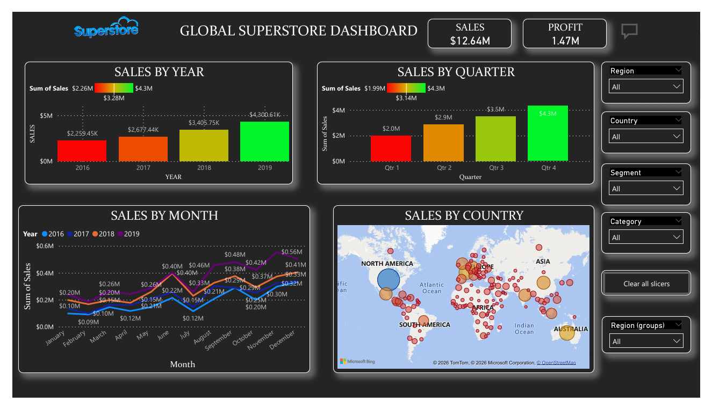

---
# Global Superstore Sales Analytics Dashboard

Interactive **Power BI dashboard** built using the **Global Superstore** dataset to analyze sales performance, profit trends, regional contribution, and customer segment behavior. The project focuses on transforming raw retail data into actionable business insights through data cleaning, modeling, and visualization.

---

## Dashboard Preview



---

## Project Overview

This dashboard helps business users monitor:

* Overall **Sales** and **Profit** performance
* **Year-wise sales growth**
* **Quarterly sales contribution**
* **Monthly sales trends**
* **Country and region-wise performance**
* **Customer segment analysis** using interactive slicers

---

## Business Problem

Retail businesses often struggle to identify:

* Which **regions and countries contribute the highest revenue**
* How **sales fluctuate across months and quarters**
* Which **customer segments drive profitability**
* Whether business performance is improving year over year

This dashboard was designed to provide a **single interactive view** for sales and profitability analysis.

---

## Tools & Technologies

| Tool                 | Purpose                          |
| -------------------- | -------------------------------- |
| **Power BI Desktop** | Dashboard development            |
| **Power Query**      | Data cleaning and transformation |
| **DAX**              | KPI calculations and measures    |
| **Excel / CSV**      | Source dataset                   |

---

## Dashboard Features

### KPI Cards

* **Total Sales:** $12.64M
* **Total Profit:** $1.47M

### Visuals Included

* **Sales by Year** (Column Chart)
* **Sales by Quarter** (Pie Chart)
* **Sales by Month** (Line Chart)
* **Sales by Country** (Map Visualization)
* Interactive **Slicers** for:

  * Region
  * Country
  * Segment
  * Category

---

## Key Insights

* Sales showed a **consistent upward trend from 2016 to 2019**.
* **Q4 generated the highest sales contribution**, indicating strong end-of-year business performance.
* **North America and parts of Europe contributed significantly to overall revenue**.
* Monthly analysis revealed **higher sales activity during the second half of the year**.
* Certain customer segments contributed **higher sales but relatively lower profit margins**, highlighting opportunities for margin optimization.

---

## Data Preparation

The following transformations were performed in **Power Query**:

* Removed duplicate records
* Handled missing values
* Standardized column names
* Corrected data types
* Created date-based fields for **Year, Quarter, and Month** analysis

---

## Repository Structure

```text
global-superstore-sales-analytics-dashboard/
│
├── README.md
├── globalsuperstoredashboard.png
├── dashboardglobalsuperstore.pdf
└── images/
```

---

## How to Use

1. Download the repository.
2. Open the **`.pbix`** file in **Power BI Desktop**.
3. Refresh the data source if prompted.
4. Use the slicers to explore sales and profit performance interactively.

---

## Project Highlights

* Built an **end-to-end Power BI reporting solution**
* Applied **data transformation, modeling, and DAX calculations**
* Designed a **dark-theme executive dashboard** for better visual storytelling
* Focused on **business insights rather than only visual design**

---

## About Me

**Abhishek Singh Bisht**

QA Engineer (BFSI) transitioning into **Business Analytics and Data Analytics**

**Skills:** SQL • Power BI • Python • Excel • API Testing • BFSI Domain • Data Visualization

* **GitHub:** https://github.com/ds-learner-akki
* **LinkedIn:** https://www.linkedin.com/in/abhishek-b-11a08abb

---

If you found this project useful, consider **starring the repository** to support my analytics portfolio.
